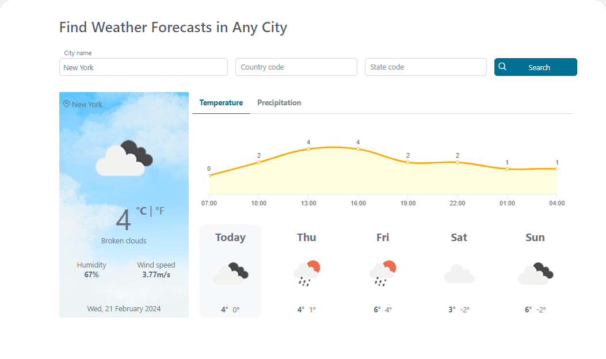
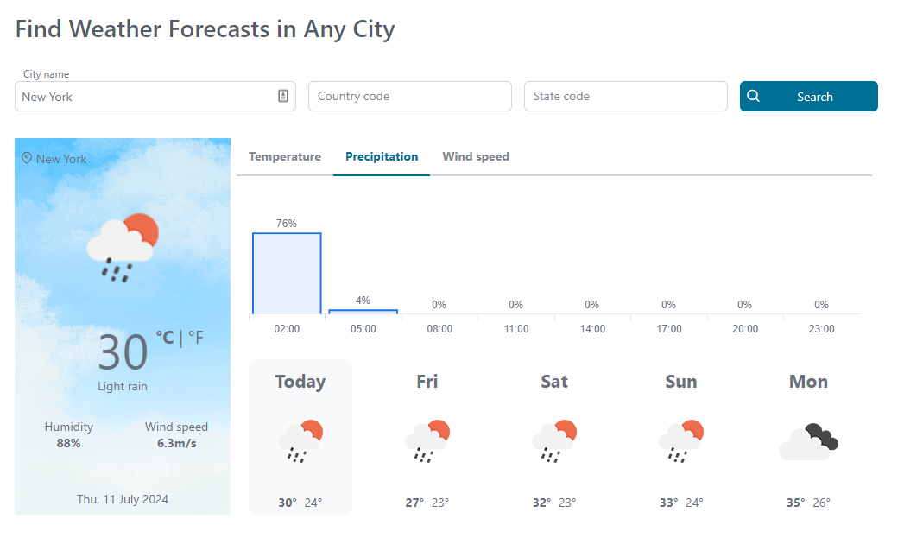
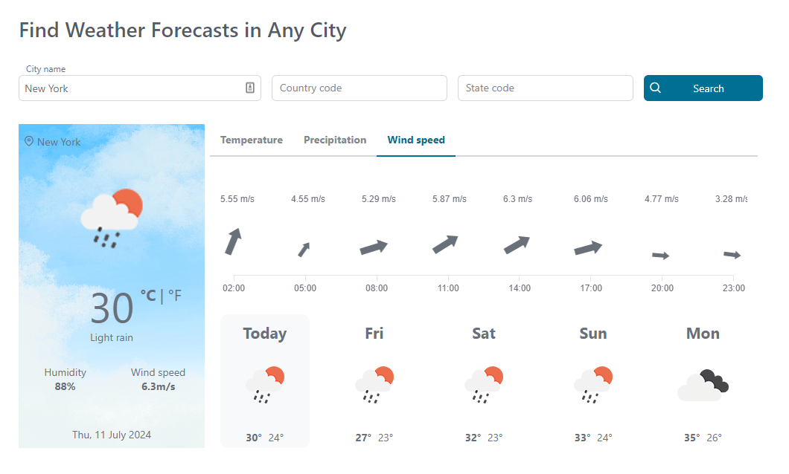

# OpenWeather Connector

Nutzen Sie die Leistungsfähigkeit frei verfügbarer Wetterdaten für Ihre
Geschäftsprozesse mit OpenWeather! Dieser Axon Ivy Connector implementiert den
Zugriff auf OpenWeatherMap-Datensätze und erstellt verschiedene Wetterkarten im
Rahmen des kostenlosen Tarifs:

* **Aktuelles Wetter:** Erhalten Sie das aktuelle Wetter für jeden Ort weltweit.
* **Erweiterte Vorhersagen:** Planen Sie voraus mit Mehrtagesvorhersagen.
* **Niederschlag:** Prognostizieren Sie die Niederschlagswahrscheinlichkeit für
  die nächsten Tage.
* **Wind:** Windstärke und vorherrschende Windrichtung können ebenfalls
  vorhergesagt werden.

Dieser Konnektor unterstützt Sie mit einer Demo-Implementierung, um Ihren
Integrationsaufwand zu reduzieren.

## Demo

In dieser Demo können Benutzer auf umfassende 5-Tage-Wettervorhersagen **** für
jeden Ort weltweit zugreifen. Befolgen Sie diese einfachen Schritte:

1. **Genaue Standortangabe:** Geben Sie den gewünschten Standort genau an, indem
   Sie den Namen der Stadt und den entsprechenden Ländercode eingeben. Bei
   Standorten innerhalb der Vereinigten Staaten wird die Vorhersage durch die
   Angabe des Bundesstaatscodes weiter verfeinert.
2. ** **Suche starten:** Klicken Sie einfach auf die Schaltfläche „ **Suche** ”,
   um den Abrufvorgang zu aktivieren. Der Connector ruft effizient eine
   detaillierte 5-Tage-Vorhersage** für den von Ihnen gewählten Standort ab und
   zeigt sie an.


 

## Setup

### Anwendungs-ID
Die OpenWeatherMap-Wetter-API ist nicht kostenlos nutzbar. Es gibt jedoch eine
kostenlose Version mit minimalen API-Aufrufen für Entwicklungszwecke. Um den
Konnektor zu verwenden, wählen Sie ein geeignetes API-Paket über den
[OpenWeatherMap API Developer](https://openweathermap.org/api) aus und
generieren Sie einen **API-Schlüssel**.

##### So erhalten Sie einen API-Schlüssel
1. Melden Sie sich an und gehen Sie zu Ihrer [OpenWeatherMap
   API-Schlüsselseite](https://home.openweathermap.org/api_keys).
2. Fügen Sie Ihren API-Schlüsselnamen hinzu und generieren Sie ihn: 
3. Der API-Schlüssel ist jetzt verfügbar: 

Nachdem ein API-Schlüssel für **** verfügbar ist, können Sie ihn in Ihrem
Projekt in der Datei variables.yaml als Variable „openWeatherConnector.appId”
speichern:

```
@variables.yaml@
```
